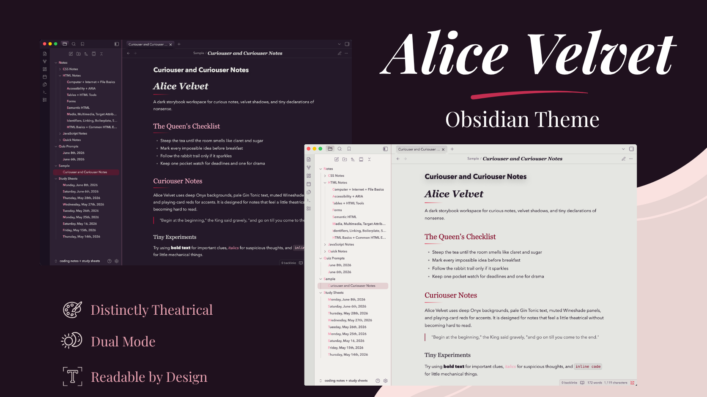

# Alice Velvet

Alice Velvet is a dark and light theme for [Obsidian](https://obsidian.md/) inspired by whimsical storybooks, velvet shadows, playing-card reds, and an Alice-in-Wonderland palette.

Dark mode uses deep Onyx backgrounds, muted Wineshade surfaces, pale Gin Tonic text, and dramatic Claret and Red Suits accents. Light mode reworks the same visual system into a softer, aged-paper-inspired workspace for daytime writing.

## Features

- Coordinated dark and light color systems
- Custom styling across the editor, navigation, workspace, graph view, callouts, tags, tables, code, embeds, and interface surfaces
- Dedicated syntax-highlighting palettes for dark and light modes
- Responsive layouts with mobile and tablet-specific adjustments
- Configurable note and code-block widths
- Custom note layouts including cards, panels, galleries, and accent text
- Styled graph view and graph controls
- Optional Style Settings integration
- Customizable typography with system-safe fallbacks
- Decorative headings and themed interface details

## Style Settings

Alice Velvet includes optional support for the **Style Settings** plugin.

Available controls include:

- Note width
- Code block width
- Decorative heading lines
- Embed framing
- Title font
- Heading font
- Body font
- Accent font

Style Settings is optional. Alice Velvet works without the plugin using its default configuration.

## Typography

Alice Velvet is designed around the following fonts:

- **Cormorant Garamond** — note titles
- **Yeseva One** — headings
- **Nunito** — body and interface text
- **Emilys Candy** — accent elements

These fonts are optional. The theme includes fallback font stacks and remains usable without them installed.

Typography can also be customized through Style Settings.

## Responsive Design

Alice Velvet includes dedicated adjustments for desktop, tablet, and mobile layouts.

Smaller screens receive adjusted typography, note spacing, callout and embed sizing, code-block behavior, and constrained modal and popover widths to preserve readability and usability.

## Installation

### Obsidian Community Themes

Alice Velvet is available through Obsidian's official Community Themes directory:

1. Open **Settings > Appearance**
2. Next to **Themes**, select **Manage**
3. Search for **Alice Velvet**
4. Select **Install and use**

### Manual Installation

1. Download `theme.css` and `manifest.json` from the latest GitHub release.
2. Create an `Alice Velvet` folder inside your vault's `.obsidian/themes/` directory.
3. Place both files inside the folder.
4. Restart Obsidian.
5. Open **Settings > Appearance** and select **Alice Velvet**.

## Custom Layouts

Alice Velvet includes optional CSS classes for additional note presentation.

### Cards

Use `alice-card` to give content a framed card treatment.

### Panels

Use `alice-panel` for a lightly accented section separated by themed borders.

### Galleries

Use `alice-gallery` to create a responsive image grid that automatically adjusts to available space.

### Accent Text

Use `alice-kicker` for small decorative accent text using the theme's accent typography.

These classes are optional and do not affect standard notes.

## Palette

| Color | Hex |
|---|---|
| Onyx | `#241929` |
| Wineshade | `#5A4864` |
| Gin Tonic | `#E5E6E1` |
| False Goat's Beard | `#F696B3` |
| Red Suits | `#DD1440` |
| Claret | `#840B2A` |

## Technical Design

Alice Velvet is implemented as a standalone CSS theme that extends Obsidian's existing interface and design variables.

The theme uses reusable CSS custom properties to coordinate its color, typography, spacing, interface, and layout systems across separate dark and light modes. Obsidian's design tokens are mapped into the Alice Velvet palette so interface components inherit a consistent visual system while still working within Obsidian's native structure.

Optional Style Settings controls expose selected CSS variables and body classes without requiring users to modify the stylesheet directly.

Responsive rules provide dedicated mobile and tablet behavior, while reusable CSS classes allow individual notes to opt into additional layouts without changing the underlying application.

## Compatibility

Alice Velvet includes responsive styling for desktop, tablet, and mobile layouts.

Because Obsidian and community plugins can introduce their own interface styles, some third-party plugins or CSS snippets may override parts of the theme. If something appears incorrect, test with custom snippets temporarily disabled before reporting an issue.

## License

Alice Velvet is released under the [MIT License](LICENSE).
